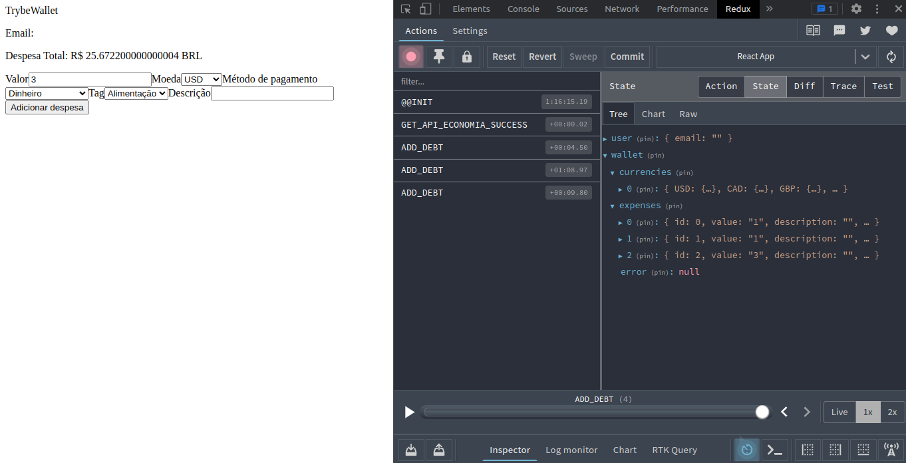

# Projeto Trybewallet
## 📋 Descrição do projeto
Uma aplicação de uma carteira de controle de gastos com conversor de moedas. Utilizando uma [API de criptomoedas](https://economia.awesomeapi.com.br/json/all).

## 📷 Screenshot

## 💻 Tecnologias utilizadas
- JavaScript
- React
- React-router
- Redux
- Redux-thunk

## 🎓 Aprendizados
- Criar um store Redux em aplicações React
- Criar reducers no Redux em aplicações React
- Criar actions no Redux em aplicações React
- Criar dispatchers no Redux em aplicações React
- Conectar Redux aos componentes React
- Criar actions assíncronas na sua aplicação React que faz uso de Redux.

## 📈 Status do projeto
- **Em desenvolvimento**

## 🚀 Links
- Site no ar: [Link](https://trybewallet-dogl4.vercel.app/)

## :busts_in_silhouette: Contribuintes
<table>

<tr  style="width:120px">

<td  align="center">

<a  target=”_blank”  href="https://github.com/Dogl4">

 

<b>Pedro Barreto</b>

</a>

</td>

</tr>

</table>
